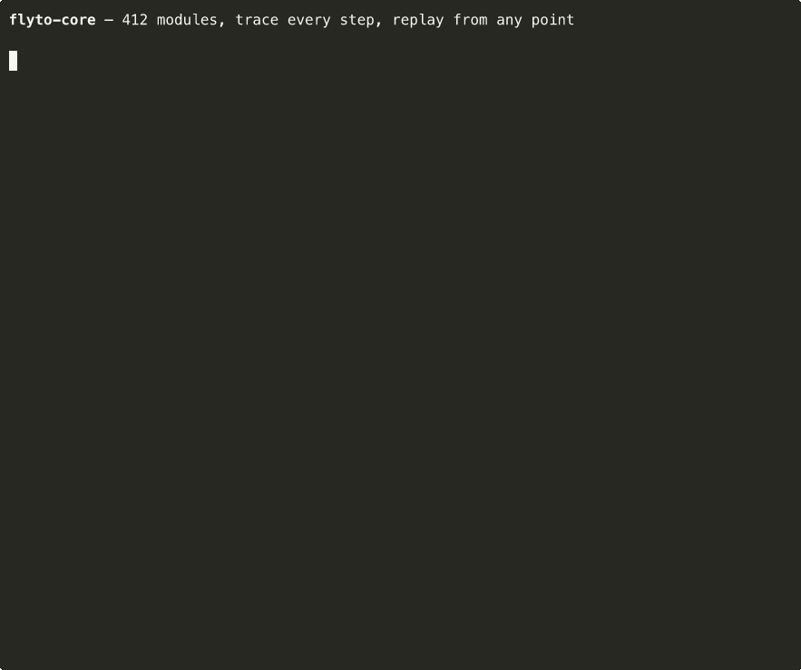

[](https://mseep.ai/app/flytohub-flyto-core)
[](https://mseep.ai/app/9a708224-9666-46b6-8660-dad08fb16096)

# Flyto2 Core - Open-Source AI Agent Framework and Workflow Automation Engine

[](https://pypi.org/project/flyto-core/)
[](https://opensource.org/licenses/Apache-2.0)
[](https://www.python.org/downloads/)

<!-- mcp-name: io.github.flytohub/flyto-core -->

> **The open-source execution engine for AI agents. 452 modules, MCP-native, triggers, queue, versioning, metering.**
>
> **[flyto2.com](https://flyto2.com)** · [Cloud Automation](https://flyto2.com/cloud/) · [Documentation](https://docs.flyto2.com) · [MCP Docs](https://docs.flyto2.com/mcp/) · [YouTube](https://www.youtube.com/@Flyto2)

Flyto2 Core is the open-source runtime behind Flyto2. It is built for people who
want an **AI agent framework** that actually runs work: browser automation, API
integration, web scraping, MCP server automation, replayable YAML recipes,
evidence capture, and deterministic tools that agents can call without
inventing unreviewed code.

Use it when the question is simple but the job is annoying: "open this page,
capture the proof, extract the data, check performance, and let me retry only
the failed step." Flyto2 Core gives you a local execution engine for browser
automation, workflow replay, AI-agent tool calls, Web Vitals checks, screenshot
capture, structured extraction, and audit-ready evidence.

The current public inventory is **452 registry-backed modules** across **84
catalog categories**, including triggers, queue modules, workflow versioning,
metering hooks, browser automation, API calls, data transforms, verification,
files, and crypto.

Good fit if you searched for:

- open source AI agent framework for production workflows
- Python AI workflow automation with Playwright
- MCP server automation with trace and replay
- browser automation that can resume from a failed step

### Try in 30 seconds

```bash
pip install flyto-core[browser] && playwright install chromium
flyto recipe competitor-intel --url https://github.com/pricing
```

```
  Step  1/12  browser.launch         ✓      420ms
  Step  2/12  browser.goto           ✓    1,203ms
  Step  3/12  browser.evaluate       ✓       89ms
  Step  4/12  browser.screenshot     ✓    1,847ms  → saved intel-desktop.png
  Step  5/12  browser.viewport       ✓       12ms  → 390×844
  Step  6/12  browser.screenshot     ✓    1,621ms  → saved intel-mobile.png
  Step  7/12  browser.viewport       ✓        8ms  → 1280×720
  Step  8/12  browser.performance    ✓    5,012ms  → Web Vitals captured
  Step  9/12  browser.evaluate       ✓       45ms
  Step 10/12  browser.evaluate       ✓       11ms
  Step 11/12  file.write             ✓        3ms  → saved intel-report.json
  Step 12/12  browser.close          ✓       67ms

  ✓ Done in 10.3s — 12/12 steps passed
```

Screenshots captured. Performance metrics extracted. JSON report saved. **Every step traced.**

<p align="center">
  
</p>

---

## What happens when step 8 fails?

With a shell script you re-run the whole thing. With flyto-core:

```bash
flyto replay --from-step 8
```

Steps 1–7 are instant. Only step 8 re-executes. Full context preserved.

---

## 3 recipes to try now

```bash
# Competitive pricing: screenshots + Web Vitals + JSON report
flyto recipe competitor-intel --url https://competitor.com/pricing

# Full site audit: SEO + accessibility + performance
flyto recipe full-audit --url https://your-site.com

# Web scraping → CSV export
flyto recipe scrape-to-csv --url https://news.ycombinator.com --selector ".titleline a"
```

Every recipe is traced. Every run is replayable. [See all 41 recipes ->](docs/RECIPES.md)

---

## Install

```bash
pip install flyto-core            # Core engine + CLI + MCP server
pip install flyto-core[browser]   # + browser automation (Playwright)
playwright install chromium        # one-time browser setup
```

---

## The 85-line problem

Here's what competitive pricing analysis looks like in Python:

<table>
<tr>
<td width="50%">

**Python** — 85 lines

```python
import asyncio, json, time
from playwright.async_api import async_playwright

async def main():
    async with async_playwright() as p:
        browser = await p.chromium.launch()
        page = await browser.new_page()
        await page.goto("https://competitor.com/pricing")

        # Extract pricing
        prices = await page.evaluate("""() => {
            const cards = document.querySelectorAll(
              '[class*="price"]'
            );
            return Array.from(cards).map(
              c => c.textContent.trim()
            );
        }""")

        # Desktop screenshot
        await page.screenshot(
            path="desktop.png", full_page=True
        )

        # Mobile
        await page.set_viewport_size(
            {"width": 390, "height": 844}
        )
        await page.screenshot(
            path="mobile.png", full_page=True
        )

        # Performance
        perf = await page.evaluate("""() => {
            const nav = performance
              .getEntriesByType('navigation')[0];
            return {
              ttfb: nav.responseStart,
              loaded: nav.loadEventEnd
            };
        }""")

        # Save report
        report = {
            "prices": prices,
            "performance": perf,
        }
        with open("report.json", "w") as f:
            json.dump(report, f, indent=2)

        await browser.close()

asyncio.run(main())
```

</td>
<td width="50%">

**flyto-core** — 12 steps

```yaml
name: Competitor Intel
steps:
  - id: launch
    module: browser.launch
  - id: navigate
    module: browser.goto
    params: { url: "{{url}}" }
  - id: prices
    module: browser.evaluate
    params:
      script: |
        JSON.stringify([
          ...document.querySelectorAll(
            '[class*="price"]'
          )
        ].map(e => e.textContent.trim()))
  - id: desktop_shot
    module: browser.screenshot
    params: { path: desktop.png, full_page: true }
  - id: mobile
    module: browser.viewport
    params: { width: 390, height: 844 }
  - id: mobile_shot
    module: browser.screenshot
    params: { path: mobile.png, full_page: true }
  - id: perf
    module: browser.performance
  - id: save
    module: file.write
    params:
      path: report.json
      content: "${prices.result}"
  - id: close
    module: browser.close
```

</td>
</tr>
<tr>
<td>

No trace. No replay. No timing. If step 5 fails, re-run everything.

</td>
<td>

Full trace. Replay from any step. Per-step timing. Every run is debuggable.

</td>
</tr>
</table>

---

## Current Platform Snapshot

- **Open-source AI agent framework boundary**: MCP-compatible clients call reviewed flyto-core modules through schemas, not arbitrary generated production code.
- **AI workflow automation substrate** for browser automation, API workflows, data/file operations, AI calls, notifications, verification, trace, evidence, and replay.
- **452 registry-backed modules** across **84 catalog categories**. `docs/TOOL_CATALOG.md` is generated from `ModuleRegistry`, not hand-counted.
- **41 built-in recipes** for audit, browser automation, data/image work, DevOps, integrations, and deterministic verification.
- **Deterministic verification modules** (`verification.*` with `warroom.*` compatibility aliases) support site graph discovery, replay scenario generation, run evidence, and report packs.
- **Hardened outbound and file access** in the 2.26.x line: guarded HTTP clients prevent SSRF bypasses, and file/data writes are confined through the sandbox path guard.
- **Replayable browser and workflow execution** remains the core contract: every step can produce trace data, evidence snapshots, and targeted replay from the failing point.

## Public Naming Contract

- Use **Flyto2** for the product and company-facing brand. Do not use a
  shortened legacy spelling in public docs, examples, or SEO copy.
- Use `flyto2.com`, `docs.flyto2.com`, and `blog.flyto2.com` as the public citation surfaces.
- Public example contact addresses should use registered `@flyto2.com` mailboxes such as `support@flyto2.com`, `security@flyto2.com`, `privacy@flyto2.com`, `sales@flyto2.com`, `team@flyto2.com`, `dev@flyto2.com`, `alerts@flyto2.com`, `oncall@flyto2.com`, `reports@flyto2.com`, `noreply@flyto2.com`, `dmarc@flyto2.com`, `conduct@flyto2.com`, `admin@flyto2.com`, `pentest@flyto2.com`, `hello@flyto2.com`, and `info@flyto2.com`.
- Public docs, blog, and landing pages should cite the current core facts above instead of stale module counts.

## SEO and Citation Contract

Use these descriptions in public docs, blog posts, package metadata, MCP registry pages, and GitHub summaries:

- **Short:** flyto-core is the open-source execution engine for AI agents: 452 modules, MCP-native, triggers, queue, versioning, metering.
- **Technical:** flyto-core exposes 452 registry-backed modules across 84 catalog categories through CLI, API, YAML recipes, and MCP server transports so agents and operators compose deterministic workflows with triggers, queues, workflow versioning, metering hooks, trace, evidence capture, and replay.
- **Search intent:** open-source execution engine for AI agents, AI workflow automation, MCP-native AI agent tools, MCP server automation, AI workflow automation with triggers and queues, no-code browser automation, self-hosted workflow automation, replayable automation workflows.

## Engine Features

- **Execution Trace** — structured record of every step: input, output, timing, status
- **Replay** — re-execute from any step with the original (or modified) context
- **Breakpoints** — pause execution at any step, inspect state, resume
- **Evidence Snapshots** — full state before and after each step boundary
- **Data Lineage** — track data flow across steps, build dependency graphs
- **Timeout Guard** — configurable workflow-level and per-step timeout protection

## Architecture

CLI, MCP, HTTP, Python, and packaged recipes converge on the same workflow
engine, module registry, policy, trace, evidence, and replay boundaries. Start
with the [Technical Whitepaper](docs/WHITEPAPER.md), then use the
[Architecture Map](docs/architecture-map.md) and exhaustive
[source reference](docs/reference/README.md) for implementation detail.

## Configuration

Core is configured through package extras, CLI arguments, workflow parameters,
module policy, environment variables, and local run state. Security-sensitive
network, filesystem, auth, callback, and permission switches are documented in
[Configuration](docs/CONFIGURATION.md); all 93 detected environment readers are
linked to source in the generated
[configuration reference](docs/reference/configuration.md).

---

## API / Module Reference

## 452 Modules, 84 Catalog Categories

| Category | Count | Examples |
|----------|-------|----------|
| `browser.*` | 54 | launch, goto, click, evaluate, screenshot, performance, challenge |
| `flow.*` | 24 | switch, loop, branch, parallel, retry, circuit breaker, rate limit |
| `array.*` | 15 | filter, sort, map, reduce, unique, chunk, flatten |
| `api.*` | 13 | OpenAI, Anthropic, Gemini, Notion, Slack, Telegram |
| `data.*` | 13 | JSON, YAML, CSV, XML parse/generate/convert |
| `string.*` | 11 | reverse, uppercase, split, replace, trim, slugify, template |
| `ai.*` | 10 | chat, model calls, vision, embeddings, moderation |
| `object.*` | 10 | keys, values, merge, pick, omit, get, set, flatten |
| `testing.*` | 10 | assertions, scenarios, E2E steps, reports |
| `image.*` | 9 | resize, convert, crop, rotate, watermark, OCR, compress |
| `verify.*` | 9 | evidence, visual diff, rulesets, annotations |
| `file.*` | 8 | read, write, copy, move, delete, exists, edit, diff |
| `stats.*` | 8 | mean, median, percentile, correlation, standard deviation |
| `test.*` | 8 | API, browser, and visual checks |
| `check.*` | 7 | validation and guard checks |
| `crypto.*` | 7 | AES encrypt/decrypt, JWT create/verify, hashes |
| `http.*` | 7 | get, request, batch, paginate, session |
| `validate.*` | 7 | email, url, json, phone, credit card |
| 66 more prefixes | 221 | Docker, archive, math, k8s, network, PDF, AWS, cache, git |

See the **[Full Module Catalog](docs/TOOL_CATALOG.md)** for every module, parameter, and description.

---

## How is this different?

| | Playwright / Selenium | Shell scripts | flyto-core |
|-|----------------------|---------------|------------|
| Step 8 fails | Re-run everything | Re-run everything | `flyto replay --from-step 8` |
| What happened at step 3? | Add print(), re-run | Add echo, re-run | Full trace: input, output, timing |
| Browser + API + file I/O | Write glue code | 3 languages | All built-in |
| Share with team | "Clone my repo" | "Clone my repo" | `pip install flyto-core` |
| Run in CI | Wrap in pytest/bash | Fragile | `flyto run workflow.yaml` |

---

## Usage

<details>
<summary><b>CLI</b> — run workflows from the terminal</summary>

```bash
# Run a built-in recipe
flyto recipe site-audit --url https://example.com

# Run your own YAML workflow
flyto run my-workflow.yaml

# List all recipes
flyto recipes
```

</details>

<details>
<summary><b>MCP Server</b> — for Claude Code, Cursor, Windsurf</summary>

```bash
pip install flyto-core
claude mcp add flyto-core -- python -m core.mcp_server
```

Or add to your MCP config:
```json
{
  "mcpServers": {
    "flyto-core": {
      "command": "python",
      "args": ["-m", "core.mcp_server"]
    }
  }
}
```

Your AI gets all 452 modules as tools.

</details>

<details>
<summary><b>HTTP API</b> — for integrations and remote execution</summary>

```bash
pip install flyto-core[api]
flyto serve
# ✓ flyto-core running on 127.0.0.1:8333
```

| Endpoint | Purpose |
|----------|---------|
| `POST /v1/workflow/run` | Execute workflow with evidence + trace |
| `POST /v1/workflow/{id}/replay/{step}` | Replay from any step |
| `POST /v1/execute` | Execute a single module |
| `GET /v1/modules` | Discover all modules |
| `POST /mcp` | MCP Streamable HTTP transport |

</details>

<details>
<summary><b>Python API</b> — for programmatic use</summary>

```python
import asyncio
from core.modules.registry import ModuleRegistry

async def main():
    result = await ModuleRegistry.execute(
        "string.reverse",
        params={"text": "Hello"},
        context={}
    )
    print(result)  # {"ok": True, "data": {"result": "olleH"}}

asyncio.run(main())
```

</details>

---

## 41 Built-in Recipes

No code required — every recipe is a YAML workflow template:

```bash
flyto recipes                  # List all recipes

# Audit & Testing
flyto recipe full-audit       --url https://example.com
flyto recipe competitor-intel --url https://github.com/pricing
flyto recipe site-audit       --url https://example.com
flyto recipe web-perf         --url https://example.com
flyto recipe flyto2-ui-login-smoke --login_url https://myapp.com/login --page_url https://myapp.com/projects --username team@flyto2.com --password "$FLYTO_TEST_PASSWORD"
flyto recipe form-fill        --url https://myapp.com/form --data '{"email":"dev@flyto2.com"}'

# Browser Automation
flyto recipe screenshot        --url https://example.com
flyto recipe responsive-report --url https://example.com
flyto recipe page-to-pdf       --url https://example.com
flyto recipe visual-snapshot   --url https://example.com
flyto recipe webpage-archive   --url https://example.com
flyto recipe scrape-page       --url https://example.com --selector h1
flyto recipe scrape-links      --url https://example.com
flyto recipe scrape-table      --url https://en.wikipedia.org/wiki/YAML --selector .wikitable
flyto recipe stock-price       --symbol AAPL

# Data & Image
flyto recipe ocr               --input scan.png
flyto recipe csv-to-json       --input data.csv
flyto recipe image-resize      --input photo.jpg --width 800
flyto recipe image-convert     --input photo.png --format webp

# Network & DevOps
flyto recipe port-scan         --host example.com
flyto recipe whois             --domain example.com
flyto recipe monitor-site      --url https://myapp.com
flyto recipe docker-ps
flyto recipe git-changelog

# Integrations
flyto recipe scrape-to-slack   --url https://example.com --selector h1 --webhook $SLACK_URL
flyto recipe github-issue      --url https://example.com --owner me --repo my-app --title "Bug" --token $GITHUB_TOKEN
```

Each recipe is a YAML workflow template. Run `flyto recipe <name> --help` for full options.
See **[docs/RECIPES.md](docs/RECIPES.md)** for full documentation.

---

## Write Your Own Workflows

Recipes are just YAML files. Write your own:

```yaml
name: price-monitor
steps:
  - id: open
    module: browser.launch
    params: { headless: true }

  - id: page
    module: browser.goto
    params: { url: "https://competitor.com/pricing" }

  - id: prices
    module: browser.evaluate
    params:
      script: |
        JSON.stringify([...document.querySelectorAll('.price')].map(e => e.textContent))

  - id: save
    module: file.write
    params: { path: "prices.json", content: "${prices.result}" }

  - id: close
    module: browser.close
```

```bash
flyto run price-monitor.yaml
```

Every run produces an execution trace and state snapshots. If step 3 fails, replay from step 3 — no re-running the whole thing.

---

## For Module Authors

```python
from core.modules.registry import register_module
from core.modules.schema import compose, presets

@register_module(
    module_id='string.reverse',
    version='1.0.0',
    category='string',
    label='Reverse String',
    description='Reverse the characters in a string',
    params_schema=compose(presets.INPUT_TEXT(required=True)),
    output_schema={'result': {'type': 'string', 'description': 'Reversed string'}},
)
async def string_reverse(context):
    text = str(context['params']['text'])
    return {'ok': True, 'data': {'result': text[::-1]}}
```

See **[Module Specification](docs/MODULE_SPECIFICATION.md)** for the complete guide.

---

## Contributing

We welcome contributions! See **[CONTRIBUTING.md](CONTRIBUTING.md)** for guidelines.

## Testing

```bash
python -m pytest
python -m ruff check .
flyto recipe full-audit --url https://example.com
```

## Security

Report security vulnerabilities via **[security@flyto2.com](mailto:security@flyto2.com)**.
See **[SECURITY.md](SECURITY.md)** for our security policy.

## License

[Apache License 2.0](LICENSE) — free for personal and commercial use.

---

**[Cloud Automation](https://flyto2.com/cloud/)** · **[Pricing](https://flyto2.com/pricing/)** · **[flyto2.com](https://flyto2.com)**

## Hosted deployment

A hosted deployment is available on [Frontier AI](https://fronteir.ai/mcp/flytohub-flyto-core).
